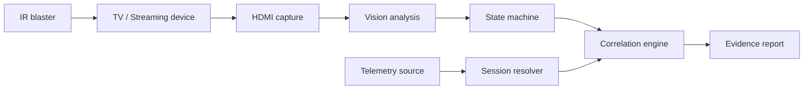

# Signal & Noise — Screen-to-Events Correlator

Correlate **what users actually saw** on a TV/device screen with **what telemetry claims happened**.

This is a generic, vendor-agnostic reference implementation for hardware-in-the-loop observability:
- the screen is the **source of truth**
- telemetry is a **set of claims**
- correlation is **explainable** and **evidence-backed**

## What it does
Given:
1) a video capture of the device output (HDMI capture recommended),
2) optional remote-control actions (IR blaster recommended), and
3) an application telemetry stream (queried from a datastore/search index/stream),

…the system produces:
- a screen-derived **state timeline** (playback/buffering/ad/error/etc.)
- a telemetry-derived **event timeline** (whatever your system emits)
- an **alignment model** (offset/drift estimates)
- a **correlation report** with mismatches and screenshot evidence

## Why this exists
Telemetry is essential, but not infallible. In real systems it can be missing, late, early, optimistic, or simply wrong. The user experience is what matters, and the most reliable signal is often the thing the user can actually see.

## Core principles
- **Screen first:** the screen is the ground truth.
- **Verify actions:** remote inputs are not trusted until visually confirmed.
- **Gate telemetry:** do not correlate telemetry until the target app is visibly open.
- **Be generic:** no assumptions about proprietary schemas or platform APIs.
- **Prefer explainable heuristics:** state machines over opaque magic for MVPs.

## Architecture


## Demo walkthrough (example run)
1. Start HDMI capture (or load a recorded session).
2. Navigate into the target streaming app (IR automation or manual).
3. Vision confirms **App Open**; only then telemetry queries begin.
4. Resolve session identity (bootstrap if needed, otherwise use known device identity).
5. Trigger playback and observe states (buffering, playback, ads, pauses, errors).
6. Align timelines using anchor points and estimate offset/drift.
7. Generate `report.md` with evidence frames for mismatches.

## Session and device identity
Most telemetry ecosystems include:
- a **session/visit identifier** (ephemeral)
- a **device identifier** (stable)

This repo does not assume names or structures. It supports a generic lifecycle:
- **Bootstrap mode (first run):** resolve the correct session, then learn and persist a stable device identifier.
- **Known-device mode:** filter telemetry by that device identifier and select the active session deterministically.

## Hardware needed
### Required for a full loop
- TV/streaming device
- HDMI capture device (UVC compliant recommended)
- Development machine (macOS/Linux)

### Optional but recommended
- IR blaster for repeatable automation
- HDMI splitter for passthrough viewing

### Incremental bring-up
You can build much of the system without all hardware:
- HDMI only: vision + state timeline + synthetic telemetry
- IR only: action sequencing + verification stubs
- Device only: manual navigation + recorded analysis

## Known limitations
- **Heuristic vision:** UI changes may require detector tweaks.
- **Timing is approximate:** network buffering, batching, and clock skew limit precision.
- **Not a replacement for telemetry:** this complements telemetry by validating it.
- **Platform variance:** some platforms expose more diagnostics than others; the system adapts rather than assumes.

## Repo layout
```
src/screen2events/
  cli.py
  video/          # capture, frame sampling, detectors, state machine
  control/        # IR abstractions + visual verification loop
  events/         # adapters (Athena/OpenSearch skeletons) + normalization
  session_id/     # session/device identity resolution
  correlate/      # alignment, matching, anomaly rules
  report/         # markdown report + evidence frame export
examples/
  config.example.yaml
```

## Example integrations (illustrative)

This repository is intentionally vendor-agnostic. The examples directory contains
concrete reference implementations you can adapt. The most reproducible and broadly
relatable option is S3 (JSONL files of `NormalizedEvent`), followed by Athena and
OpenSearch examples for teams with analytics or observability stacks.

S3 (recommended, lowest friction):

- Capture a session to `session.mp4` using any UVC-compatible capture.
- Configure `examples/s3_config.yaml` (contains `s3_bucket`, `s3_prefix`, and optional region/profile).
- Install optional extras and run:

```bash
source .venv/bin/activate
pip install -e '.[video,s3,ir]'
s2e run --config examples/s3_config.yaml --video session.mp4 --out runs
```

Athena (SQL-backed analytics):

- Use `pyathena` to query event lakes and normalize to `NormalizedEvent`.
- See `examples/config.example.yaml` for placeholders and the `aws` extras.

OpenSearch (search/observability stacks):

- Use `examples/roku_config.yaml` and the OpenSearch adapter if you have a running cluster.
- Install with `pip install -e '.[video,opensearch,ir]'` and run as shown above.

Outputs and troubleshooting are covered in `docs/IR_BLASTER.md` and the example configs.

## Device support

Tested and documented examples for popular streaming platforms:
- **Roku:** `examples/roku_config.yaml` (Broadlink/Orvibo IR)
- **Apple TV:** `examples/appletv_config.yaml` (custom HTTP or HomeKit)

All examples use the same S3 telemetry pipeline; adapt IR driver settings and vision detectors per platform.

## Quick start
### 1) Install
```bash
python -m venv .venv
source .venv/bin/activate
pip install -e .
```

### 2) Run (offline from a video file)
```bash
s2e run --config examples/config.example.yaml --video path/to/session.mp4
```

Outputs are written to `runs/<timestamp>/`.

## Documentation

- **[For WebDriver Developers](docs/for-webdriver-developers.md)** — How screen-to-events differs from browser automation; why pixel analysis beats DOM inspection
- **[Page Detection Guide](docs/page-detection-guide.md)** — Recognize streaming app pages (home, live TV, guide, search, settings) using OCR, layout, and motion patterns
- **[For Data Teams](docs/for-data-teams.md)** — Telemetry integration patterns, KPIs, S3/Athena/OpenSearch quickstarts
- **[IR Blaster Setup](docs/IR_BLASTER.md)** — Remote control automation, device-specific notes
- **[Contributing](CONTRIBUTING.md)** — Adapter pattern, test guidelines, security
- **[Copilot Instructions](/.github/copilot-instructions.md)** — Architecture, patterns, dev workflow for AI coding agents

## License
MIT
